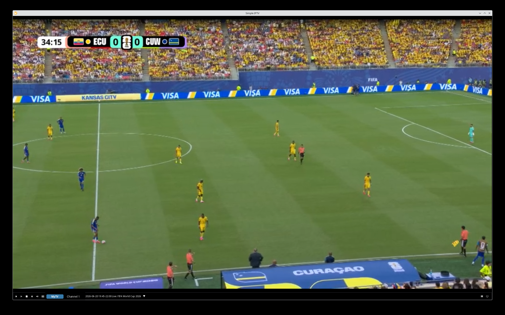
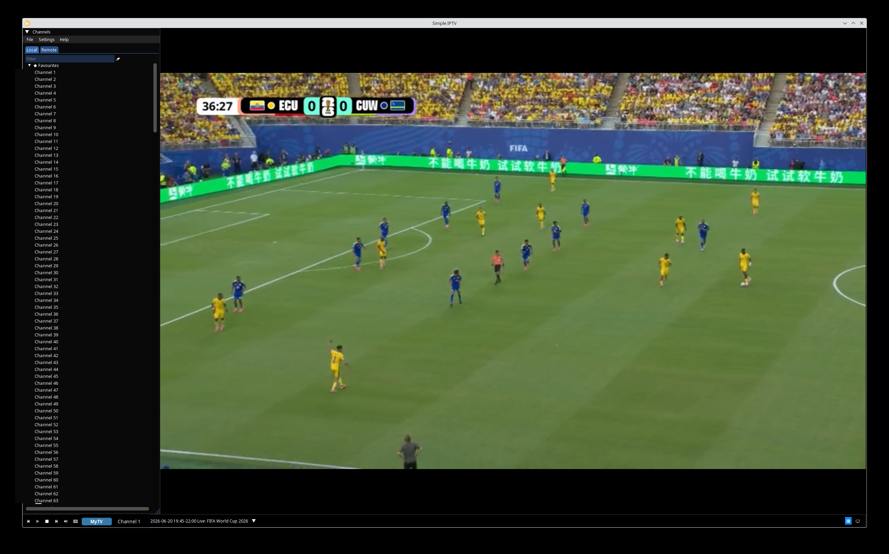
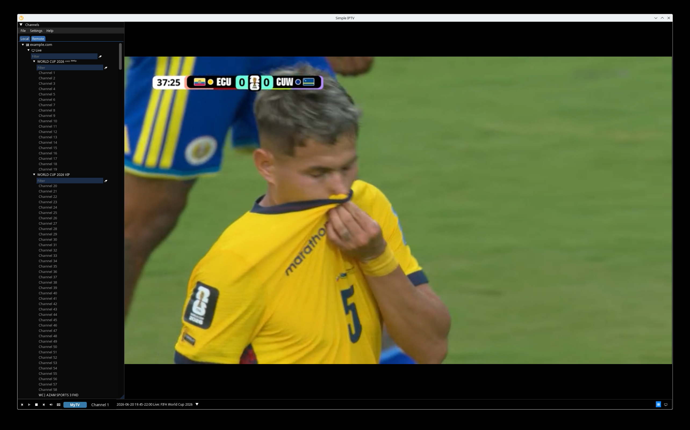
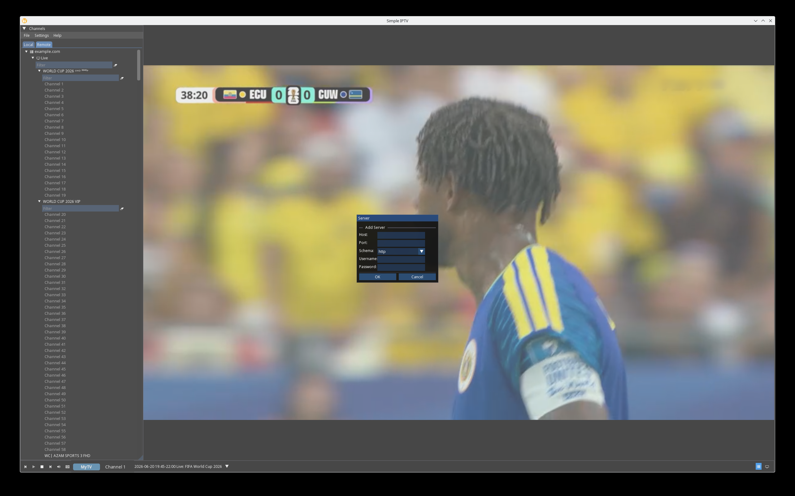

# Simple IPTV

A fast, native desktop IPTV player for [Xtream Codes](https://www.iptv-one.app/en/blog/what-is-xtream-codes) (Xtreme Codes/Xtream IPTV) providers.

Simple IPTV connects to your IPTV provider's Xtream Codes API, lets you browse
live channels organized by category, and plays them with a hardware-accelerated
[mpv](https://mpv.io/) backend rendered through Vulkan. The interface is built
with [Dear ImGui](https://github.com/ocornut/imgui) for a lightweight, low-latency
experience that idles quietly when you're not interacting with it.



## Features

- **Xtream Codes provider support** — add one or more servers by host, port,
  username and password; channels are fetched directly from the provider's
  `player_api.php`.
- **Channel browser** — channels grouped by server category, with a dedicated
  **Favourites** group and a searchable tree in the side panel.
- **Electronic Program Guide (EPG)** — full XMLTV guide import (`xmltv.php`) plus
  Xtream short EPG (`get_simple_data_table`), with a dedicated listings window.
- **Hardware-accelerated playback** — video decoded by libmpv/FFmpeg and
  presented through a Vulkan renderer; subtitles rendered with libass.
- **Multiple servers** — manage several providers and switch between them.
- **HTTP proxy support** — route provider traffic through a configurable proxy.
- **Screenshots, colorspace and player settings** built in.
- **Desktop integration on Linux** — MPRIS media-key control over D-Bus and
  screensaver inhibition while a stream is playing.
- **Cross-platform** — Linux (RPM, DEB, AppImage) and Windows (MSI).

## Screenshots

| Live playback with the channel browser |
|:--:|
|  |

| Browsing channels grouped by server category |
|:--:|
|  |

| Adding an Xtream Codes server |
|:--:|
|  |

## Installation

Pre-built packages are produced by CI for each release. Pick the one that matches
your system:

- **Fedora / RHEL** — `simpleiptv-<version>.fc<ver>.x86_64.rpm`
- **Linux (portable)** — `SimpleIPTV-<version>-x86_64.AppImage` (`chmod +x` and run)
- **Debian** — `simpleiptv_<ver>+deb<rel>_amd64.deb`
- **Windows** — the WIX-generated `.msi` installer

> The mpv/FFmpeg backend is linked into the application, so no separate media
> player installation is required.

## Building from source

Simple IPTV uses **CMake** with **[vcpkg](https://github.com/microsoft/vcpkg)** in
manifest mode for dependency management, and builds with the **Ninja** generator.

### Prerequisites

- CMake ≥ 3.30
- A C++23 compiler (Clang is used by the default preset)
- Ninja
- vcpkg, with the `VCPKG_ROOT` environment variable pointing at your checkout
- A Vulkan-capable GPU and up-to-date drivers

All third-party libraries — Boost, libmpv/FFmpeg, SQLite/SOCI, Vulkan helpers
(volk, VMA, shaderc), libass, FreeType, OpenSSL, expat and others — are resolved
automatically from [`vcpkg.json`](vcpkg.json) on first configure.

### Configure & build

The project ships with [`CMakePresets.json`](CMakePresets.json). The common
presets are:

| Preset            | Purpose                                        |
|-------------------|------------------------------------------------|
| `default`         | Debug build with tests (Clang)                 |
| `release`         | Optimized release build (Linux)                |
| `release-windows` | Optimized static release build (Windows)       |
| `asan`            | Debug build with AddressSanitizer              |
| `tsan`            | RelWithDebInfo build with ThreadSanitizer      |

```sh
# Debug build with tests
cmake --preset default
cmake --build --preset default

# Optimized release build
cmake --preset release
cmake --build --preset release
```

Convenience build scripts for packaging live in [`scripts/`](scripts/)
(`build_linux.sh`, `build_linux_app.sh` for the AppImage, and
`build_windows.ps1`).

## Usage

1. Launch **Simple IPTV**.
2. Open **Settings → Servers** (or use the *Add server* dialog) and enter your
   provider's host, port, username and password.
3. The channel list populates from the provider; expand a category in the side
   panel and double-click a channel to start playback.
4. Mark channels as favourites, browse the EPG, and use the player bar at the
   bottom for volume, fullscreen and playback controls.

Servers, settings and cached data are stored in a local SQLite database in the
OS-standard application configuration folder.


## License

Simple IPTV is free software, licensed under the **GNU General Public License
v3.0 or later** (GPLv3+). See [`gpl-3.0.rtf`](gpl-3.0.rtf) for the full text.

Copyright © 2026 Sergiu Giurgiu &lt;sgiurgiu11@gmail.com&gt;
